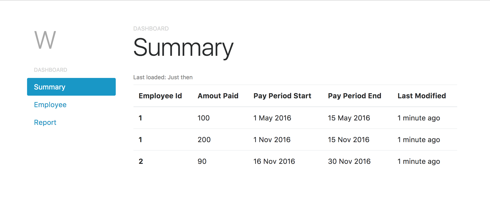

# XXX Challenge

This is a solution for XXX's Software Engineer Interview Challenge.

This project contains the following two part: 

- A back end application in `backend` fold which was built with [Scala](https://www.scala-lang.org/) and [Play Framwork](https://www.playframework.com/); this application provides a set of RESTful web services that handle requests related to Payroll reports and employees. 
- A front end app in `frontend` fold which was built with [React](https://facebook.github.io/react/) and [Redux](http://redux.js.org/docs/introduction/); this front end app act as a client of the services provided by back end app, it creates a visual presentation of the functionalities offered by backend services.

## tl;dr
- Detailed description of [backend app](#backend-app-design)
- Detailed description of [frontend app](#frontend-app-design)

## Run back-end app

__Installations__

Since this project was build with Scala version of [Play!](https://www.playframework.com/), first make sure [Scala]() and [sbt](http://www.scala-sbt.org/) are installed.

After Scala and sbt have been installed, open up a terminal, go to the `/backend` folder and compile the project:
```
$ cd <path_to_project>/backend 
$ sbt compile
```
this command will download all dependency libraries used by our project. 

It may take a few minutes to finish if sbt was freshly installed, so instead of staring at the progress bar on the terminal, we can take the time to setup our MySQL server =).

__Datastore setup__

[MySQL server](https://www.mysql.com/) was used as data store during development of this project, first [download](https://dev.mysql.com/downloads/mysql/) and install MySQL server on local machine.

After MySQL server is up and running, run the __employee.sql__ script (under `/misc` folder) to create the required schema and tables as well as initial data dump.

Now let's configure the project so that it have right access to MySQL server. In the following two files:

`./backend/wv-employee/conf/application.conf ` (line 49, 50, 51)

`./backend/wv-report/conf/application.conf ` (line 363, 364, 365)

Replace those fields with correct database url and login/password.

_Note_: `'wave_employee'` in `slick.dbs.default.db.url` is the schema name, which does not need to change, only change the domain and port within the database url. 

__Start the services__

Once MySQL has been setup and the project has been compiled, we can start the services.

_Note_: The back end application contains two services: _employee service_ (listens on port __9000__) and _report service_ (listens on port __9001__). Please make sure those two ports are available before start the services.

First start _employee service_ in terminal,
```
$ cd <path_to_project>/backend 
$ sbt employee/run
```

then open another terminal to start _report service_ by
```
$ cd <path_to_project>/backend 
$ sbt report/run
```
To test the services are up and running, open [http://localhost:9000/paygroup](http://localhost:9000/paygroup), a list of _pay group_ information should be returned by the service.

## Run front-end app
The front end app is built with [React](https://facebook.github.io/react/) and [Redux](http://redux.js.org/docs/introduction/), to run this application on local machine, first make sure [Node.js](https://nodejs.org/en/download/) is installed. Then go to frontend fold and run `npm install` to download all dependency modules.
```
$ cd <path_to_project>/frontend
$ npm install
```
after this is done start the app by running:
```
$ npm start
```
this should start the app on [http://localhost:3000](http://localhost:3000), and if everything work as expected, you should see something like the screenshot below (except your summary page should be empty at this moment =P).

Now click on the the __Report__ tab on the left navbar, and upload the __test.csv__ (it's sitting under `/misc` fold), and check what's on the summary page now =).

## Backend app design

The backend application is a RESTful API built using [Scala](https://www.scala-lang.org/) and [Play Framwork](https://www.playframework.com/) which used a lot of asynchronous designs to optimize performance.

There are three modules created for the backend app:

- __Service Library__: An abstract module that defines all the interface contracts for the services. This module is designed to be reused by other modules which will create the concrete implementations of the interfaces.

- __Employee Service__: this module is created to handle all employee related request. It contains two main domain models: __Employee__ and __Pay Group__.

- __Report Service__: this module handles all report related requests. It contains three domain models; __Report__ (the csv file), __Report Record__ (the records from csv report) and __Report Summary__ (aggregated infomation from report records). In addition, it also allows _websocket connection_ from client so that it can send out notifications to client whenever there is a update in the service (such as the report summary has been updated). 

Both services are designed with asynchronous in mind to achieve optimized performance and responsiveness. For instance, __Report Service__ utilized [Akka Actor System](http://doc.akka.io/docs/akka/current/scala/actors.html) to handle internal service event. One good use case of actor system is handling the uploaded csv report. After the user uploaded report csv file, the service will validate the data in report and response __200 OK__ right away instead of waiting the summary calculation to finish. After the calculation finish, the service will broadcast a notification to all the actors who are interested in this event; in our case, an __Websocket Actor__ will grab this event and forward it to all the clients that has created a websocket connection with our service.

## Frontend app design

[React](https://facebook.github.io/react/) is used as the MVC framework in this project to achieve best rendering performance and code reusability.
 
[Redux](http://redux.js.org/docs/introduction/) is chose as the data store backbone of this app because it enables us to do event sourcing, which reduces the complexity of managing the state of the app. 
In addition, the emphasize of immutability makes the behavior of the app predictable.

The project is structured using the group-by-feature style suggested by [Alexis Mangin](https://medium.com/@alexmngn/how-to-better-organize-your-react-applications-2fd3ea1920f1). In this style, files are grouped and nested by the feature they are supporting; each group of files are focus on a single feature which separates the concerns of change of each feature module. Comparing to group-by-type architecture, this style makes it much easier to add new features to the app as well as to remove deprecated features.

Websocket is used in this app to achieve better user experience. On initial load, the app will load the initial data from backend service and open up a websocket connection with the server. After that, anytime there is an update in the server, the server will send out a notification through the websocket, the app will then catch the notification and query the service again to get updated data. This feature enables the user to see updated data without reloading the page.